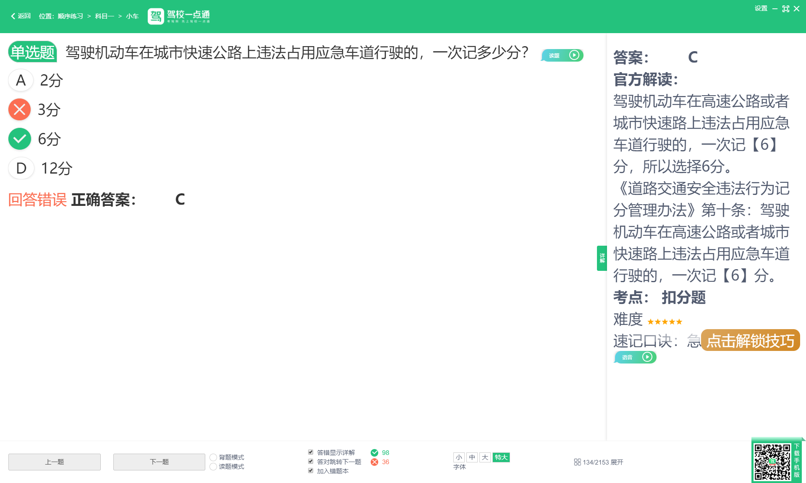
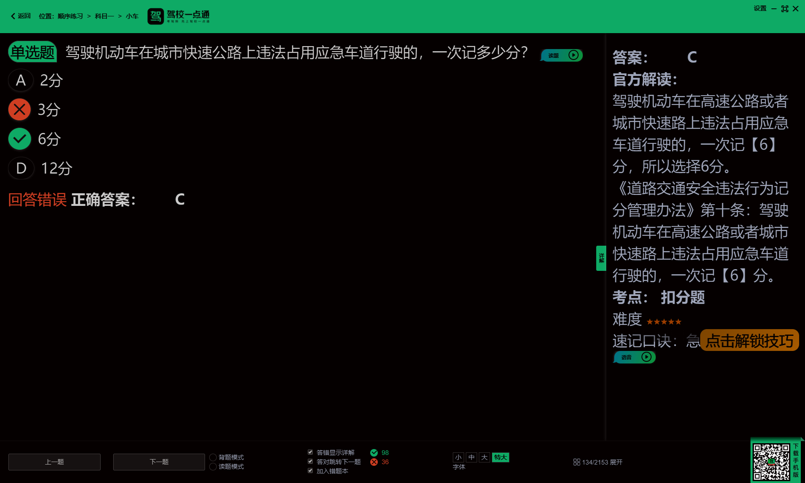

# DarkReader

[](./LICENSE)
[](https://dotnet.microsoft.com/)
[](#system-requirements)
[](https://github.com/CodingAQ/DarkReader-Desktop/releases)

English | **[简体中文](./README.md)**

> **Acknowledgment**: This project is derived from [NegativeScreen](https://github.com/mlaily/NegativeScreen) (by [mlaily](https://github.com/mlaily), GPL-3.0).
> Key improvements: window-targeted inversion, region-limited inversion, tray menu refactor, and more.
> Licensed under [GPL-3.0](./LICENSE).

## Introduction

DarkReader-Desktop is a Windows system tray application that switches the entire screen or a specified region to dark mode via color inversion, using the built-in Windows Magnification API (compositor-level color matrix).

## Screenshots

| Before | After |
|--------|-------|
|  |  |

## Features

- **Multiple preset color modes**: Default (simple inversion) + Preset 1-5 + Grayscale
- **Window following**: restrict the effect to a specific window
- **Custom region**: restrict the effect to a specific rectangular area

## Download & Install

1. Go to [Releases](https://github.com/CodingAQ/DarkReader-Desktop/releases) to download the latest package (self-contained and framework-dependent versions available)
2. Extract to any directory
3. Double-click `DarkReader.exe` to start

## Usage

### Tray Icon

| Action | Effect |
|--------|--------|
| **Left-click** tray icon | Toggle dark mode on/off |
| **Right-click** tray icon | Open the menu |

### Menu Options

- **Toggle** — Turn dark mode on/off
- **Mode** (recommends **Preset 3**)
  - **Default** — Simple color inversion
  - **Preset 1-5** — Five preset inversion modes (hue-preserving)
  - **Grayscale** — Grayscale
- **Select Region** — Select a region
- **Clear Region** — Clear the selected region
- **Select Window** — Select a target window
- **Clear Window Target** — Clear the window target
- **Pause When Not Foreground** — Auto-pause when window loses focus (recommended)
- **Active On Startup** — Enable on launch
- **Exit** — Quit the application

### Global Hotkeys

| Hotkey | Function |
|--------|----------|
| `Win + Alt + N` | Toggle dark mode on/off |
| `Win + Alt + 0` | Switch to Default |
| `Win + Alt + [1-5]` | Switch to Preset 1-5 |
| `Win + Alt + 6` | Switch to Grayscale |
| `Win + Alt + R` | Select the dark mode region |
| `Win + Alt + H` | Exit the application |

### Window Inversion

DarkReader can apply the inversion effect only to a specific window:

| Action | Effect |
|--------|--------|
| Menu → **Select Window** → pick a window | Choose a target window from the list |
| Menu → **Clear Window Target** | Clear the window target, restore fullscreen |

> When the window is obscured by other windows, the filter only covers the visible parts.

### Region Inversion

DarkReader can restrict the inversion effect to a specific screen region:

| Action | Effect |
|--------|--------|
| Menu → **Select Region** (`Win + Alt + R`) | Enter region selection mode |
| Menu → **Clear Region** | Clear the selected region, restore fullscreen |

## 7 Color Modes

| Mode | Description |
|------|-------------|
| **Default** | Simple RGB inversion, intense effect, suitable for high contrast needs |
| **Preset 1** | Theoretically optimal transform (Tom MacLeod's method), accurate colors but may oversaturate |
| **Preset 2** | Simplest 180° hue shift, high saturation, good for solid colors |
| **Preset 3** | Overall desaturated, yellows and blues darker, suitable for long reading |
| **Preset 4** | High saturation, yellows and blues darker, good readability |
| **Preset 5** | Medium saturation, CMY colors slightly desaturated, natural look |
| **Grayscale** | Global grayscale mode, all pixels converted to grayscale by luminance, keeps dark tones |

## System Requirements

- Windows 10/11 64-bit
- `*_Framework.exe` requires .NET 8 Runtime or later

## Build from Source

Requires [.NET 8 SDK](https://dotnet.microsoft.com/download) or later.

```bash
# Clone the repository
git clone https://github.com/CodingAQ/DarkReader-Desktop.git
cd DarkReader-Desktop
```

## Troubleshooting

| Problem | Solution |
|---------|----------|
| No screen change after launch | Ensure Windows DWM/Aero is enabled |
| Hotkeys not responding | Check if another app occupies the same hotkeys |
| Tray icon not showing | Check Windows notification area settings, ensure DarkReader is not hidden |
| Screen still inverted after exit | Restart the app and press `Win + Alt + N` to turn off, or restart Windows |

## License

This project is released under the [GPL-3.0](./LICENSE) license. Use, modification, and distribution must comply with the license terms.
